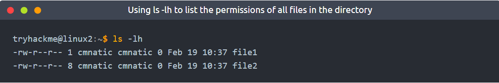
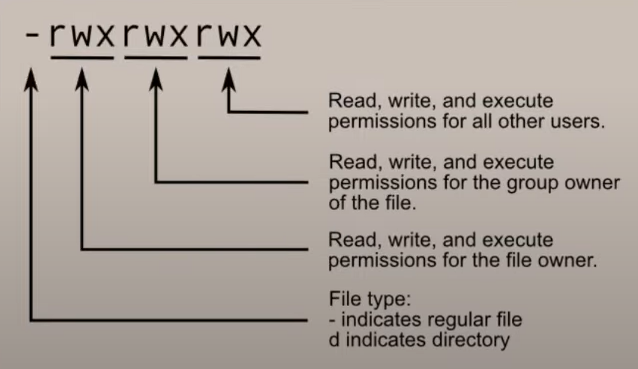

# SSH:
* Secure SHell
* common means of connecting to and interacting with the command line of a remote Linux machine
* protocol between devices in an encrypted form
* Using cryptography, input we send in a human-readable format is encrypted for travelling over a network and is then unencrypted once it reaches the remote machine
* SSH allows us to execute commands on another device remotely

## Flags and Switches:
* A majority of commands allow for arguments to be provided
* These arguments are identified by a hyphen and a certain keyword known as flags or switches
* When using a command, unless otherwise specified, it will perform its default behaviour
* Example: ls lists the contents of the working directory
    * However, hidden files are not shown
    * We can use flags and switches to extend the behaviour of commands
    * However, after using the -a argument (short for --all), we can also see the hidden files and folders
    * Files and folders with "." are hidden files.

## Help:
* Usually, commands that accept flags and swwitches will also have a --help option
* This option will list the possible options that the command accepts, provide a brief description and example of how to use it
* This option is, in fact, a formatted output of what is called the man page (short for manual), which contains documentation for Linux commands and applications

## MAN(ual) page:
* The manual pages are a great source of information for both system commands and applications available on both a Linux machine, which is accessible on the machine itself and online
* To access this documentation, we can use the man command and then provide the command we want to read the documentation for. 
* Example: **man ls**

## FileSystem Interaction:
``` bash
touch filename.extension
# Create a new file "filename.extension"

mkdir foldername
# Create a new folder "foldername"

rm filename.extension
# Remove (Delete) "filename.extension"

rm -R foldername
# Remove (Delete) "foldername"

cp file1.extension file2.extension
# Copies the content of "file1.extension" to "file2.extension"

mv file1.extension file2.extension
# Moves the content of "file1.extension" to "file2.extension"
# mv can also be used to rename a file or folder

# In linux, it is not mandatory for a file to have an extension
file filename
# Display the type of content inside the file "filename"
```

Note:
* On linux, whenever you create a new user, there is a group that's created that's named the same as the user

## Permissions and Access:
* A file or folder can have a couple of characteristics that determine both **what actions are allowed** and **what user or group has the ability to perform the given action** -- such as the following:
    * Read
    * Write
    * Execute
* Example:

* Explanation:  


``` bash
su
# substitute user (or) switch user
# Unless being a root user or using root permissions through "sudo", a user is required to know the user to switch to (userName) and the password
```

## Common Directories:
* /etc
    * This root directory is one of the most important root directories on your system
    * The etc folder (short for etcetera) is a common-place location to store system files that are used by your operating system
    * For example, the sudoers file contains a list of the users & groups that have permission to run sudo or a set of commands as the root user
    * Other few important files are the "passwd" and "shadow" files
        * These two files are special for Linux as they show how your system stores the passwords for each user in encrypted formatting called **sha512**.

* /var
    * The "/var" directory, with "var" being short for variable data,  is one of the main root folders found on a Linux install
    * This folder stores data that is frequently accessed or written by services or applications running on the system
    * For example, log files from running services and applications are written here (/var/log), or other data that is not necessarily associated with a specific user (i.e., databases and the like)

* /root
    * Unlike the /home directory, the /root folder is actually the home for the "root" system user
    * There isn't anything more to this folder other than just understanding that this is the home directory for the "root" user

* /tmp
    * This is a unique root directory found on a Linux install
    * Short for "temporary", the /tmp directory is volatile and is used to store data that is only needed to be accessed once or twice
    * Similar to the memory on your computer, once the computer is restarted, the contents of this folder are cleared out.
    * What's useful for us in pentesting is that **any user can write to this folder by default**, meaning once we have access to a machine, it serves as a **good place to store things like our enumeration scripts**.


